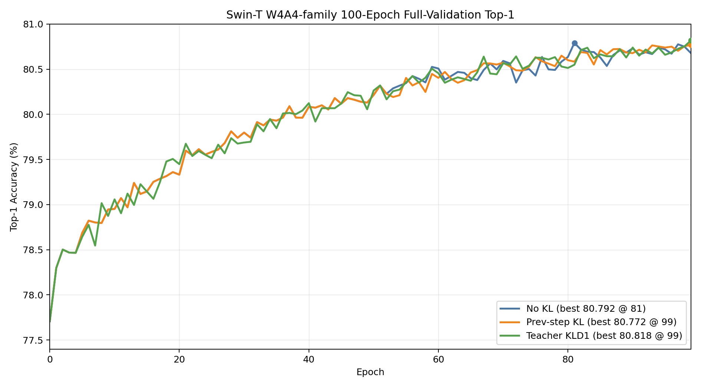
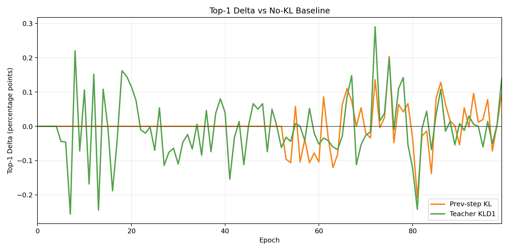

# QATs 实验记录

本仓库用于保存 Swin-T OFQ/QAT 实验代码、启动脚本、分析文档和高价值训练日志。当前重点归档的是 ImageNet Swin-T W4A4-family 的 100epoch 对照轨迹，以及后续 200epoch 长跑结果。

## 训练入口

统一入口是 `qat_launch.py`。建议优先使用 `tmp_scripts/` 里的脚本启动实验，脚本里已经固定数据路径、模型配置、分布式参数、日志路径和 checkpoint 保存频率。

常用数据与模型配置：

```text
method=ofq
model=swin_t
wbits=4, abits=4
wq_mode=statsq, aq_mode=lsq
qk_reparam=true
data=/tmp/imagenet1k_full_parquet
full validation samples=50000
```

## 三条 100epoch 轨迹

以下三条曲线都已经完整归档在 `experiment_logs/fullval_ge10/`，每条都有 100 个 `Test: [distributed-summary]` full validation 点，并且每个点都是 `Samples: 50000`。





| 路径 | 日志文件 | full-val 点数 | 完整性 |
|---|---|---:|---|
| 不开 KL | `experiment_logs/fullval_ge10/playground__train_ofq_100ep_fromscratch_original_ofq_public_control_20260714.log` | 100 | 完整 |
| 老 KL: late sparse prev-step ref KL | `experiment_logs/fullval_ge10/playground__train_ofq_100ep_fromscratch_late_sparse_prevstep_refkl_20260713.log` | 100 | 完整 |
| 最新 teacher KLD1: FP teacher attention-KL clipgrad | `experiment_logs/fullval_ge10/playground__train_ofq_100ep_fromscratch_teacher_sparse_attnkl_clipgrad_20260804.log` | 100 | 完整 |

### 优化效果汇总

| 路径 | 实验名 | Best Top-1 | Best epoch | Final Top-1 | Last10 avg | 相对 no-KL best | 相对 no-KL final | 50ep -> final |
|---|---|---:|---:|---:|---:|---:|---:|---:|
| 不开 KL | `ofq_100ep_fromscratch_original_ofq_public_control_20260714` | 80.7920 | 81 | 80.6780 | 80.7086 | +0.0000 | +0.0000 | +0.4640 |
| 老 KL | `ofq_100ep_fromscratch_late_sparse_prevstep_refkl_20260713` | 80.7720 | 99 | 80.7720 | 80.7316 | -0.0200 | +0.0940 | +0.5580 |
| 最新 teacher KLD1 | `ofq_100ep_fromscratch_teacher_sparse_attnkl_clipgrad_20260804` | 80.8180 | 99 | 80.8180 | 80.7166 | +0.0260 | +0.1400 | +0.5540 |

### 每 10 epoch 轨迹

| epoch | no-KL | 老 KL | 最新 teacher KLD1 | 老 KL - no-KL | teacher KLD1 - no-KL |
|---:|---:|---:|---:|---:|---:|
| 0 | 77.7080 | 77.7080 | 77.7080 | +0.0000 | +0.0000 |
| 10 | 78.9520 | 78.9520 | 79.0580 | +0.0000 | +0.1060 |
| 20 | 79.3320 | 79.3320 | 79.4480 | +0.0000 | +0.1160 |
| 30 | 79.7980 | 79.7980 | 79.6880 | +0.0000 | -0.1100 |
| 40 | 80.0840 | 80.0840 | 80.1240 | +0.0000 | +0.0400 |
| 50 | 80.2140 | 80.2140 | 80.2640 | +0.0000 | +0.0500 |
| 60 | 80.5080 | 80.4040 | 80.4560 | -0.1040 | -0.0520 |
| 70 | 80.5920 | 80.5720 | 80.5660 | -0.0200 | -0.0260 |
| 80 | 80.6360 | 80.6000 | 80.5140 | -0.0360 | -0.1220 |
| 90 | 80.7320 | 80.6780 | 80.7400 | -0.0540 | +0.0080 |
| 99 | 80.6780 | 80.7720 | 80.8180 | +0.0940 | +0.1400 |

### 当前判断

不开 KL 的 100epoch baseline 本身很强，在 epoch 81 达到 `80.7920`，但最终回落到 `80.6780`。

老 KL 的 best 没超过 no-KL best，但末段更稳，Final Top-1 为 `80.7720`，Last10 avg 为三条里最高的 `80.7316`。

最新 teacher KLD1 使用 FP teacher 的 attention relation 约束量化模型的 attention heads。完整 100epoch 结果达到 `80.8180`，是三条 100epoch 轨迹里最高的单点和最终点；但相对 no-KL best 只高 `+0.0260`，目前更适合表述为“teacher attention-KL 路径已跑通并且不破坏收敛”，还不能单独证明它是主要增益来源。

## 脚本目录说明

`tmp_scripts/` 是当前项目最重要的复现实验入口，里面保存了长跑、resume、评测、监控和诊断脚本。当前目录规模约为：

| 类型 | 数量 | 用途 |
|---|---:|---|
| `run_*.sh` | 314 | 启动训练、resume 或 smoke/gate 实验 |
| `eval_*.sh` | 15 | 对指定 checkpoint 做 full-val 或 fast-val |
| `monitor_*.sh` | 10 | 从训练日志抽取 epoch、acc、KL 权重和运行状态 |
| `diagnose_*.py` / `analyze_*.py` | 12 | 分析 attention relation、参数漂移、logit/class 变化、bin crossing 等 |
| `check_*.sh` | 18 | 检查 GPU、进程、日志、stage 状态或清理异常任务 |

关键脚本：

| 脚本 | 作用 |
|---|---|
| `tmp_scripts/run_ofq_100ep_fromscratch_original_ofq_public_control_20260714.sh` | 100epoch no-KL public OFQ baseline |
| `tmp_scripts/run_ofq_100ep_fromscratch_late_sparse_prevstep_refkl_20260713.sh` | 100epoch 老 KL: late sparse prev-step ref KL |
| `tmp_scripts/run_ofq_100ep_fromscratch_teacher_sparse_attnkl_clipgrad_20260804.sh` | 100epoch 最新完整 teacher KLD1 / FP teacher attention-KL |
| `tmp_scripts/run_ofq_100ep_fromscratch_teacher_sparse_attnkl_latepolish_20260805.sh` | teacher KLD1 late-polish 试验，当前不是完整最终结果 |
| `tmp_scripts/run_ofq_200ep_fromscratch_fixedcycle_group_sparse_prevstep_refkl_20260731.sh` | 当前最好 200epoch fixed-cycle sparse prev-step KL |
| `tmp_scripts/run_ofq_resume200_to300_fixedcycle_sparse_prevstep_refkl_20260802.sh` | 从 200epoch checkpoint 继续到 300epoch 的验证 |
| `tmp_scripts/monitor_ofq_100ep_fromscratch_original_ofq_public_control_20260714.sh` | no-KL 100epoch 日志监控 |
| `tmp_scripts/monitor_ofq_100ep_fromscratch_late_sparse_prevstep_refkl_20260713.sh` | 老 KL 100epoch 日志监控 |
| `tmp_scripts/analyze_attn_relation_oscillation_20260710.py` | attention relation 震荡分析 |

训练日志统一归档在 `experiment_logs/`。其中 `experiment_logs/fullval_ge10/` 保存完整或高价值 full-validation 轨迹，`experiment_logs/long_train_acc_ge20_misc/` 保存不完全满足 full-val 归档规则但仍有价值的长训练 acc 日志。

## 关键环境依赖版本

当前仓库没有单独锁定 `requirements.txt`，以下是当前验证环境快照。训练需要在 mlx GPU worker 里执行；master shell 可能无法直接访问 GPU。

| 组件 | 当前版本 / 状态 |
|---|---|
| Python | 3.11.2 |
| PyTorch | 2.9.1 |
| torchvision | 0.24.1+cu129 |
| CUDA build in PyTorch | 12.9 |
| cuDNN | 91100 |
| nvcc | 12.9.86 |
| timm | 0.4.12 |
| numpy | 2.2.6 |
| pandas | 3.0.3 |
| pyarrow | 24.0.0 |
| Pillow | 11.3.0 |
| PyYAML | 6.0.3 |
| matplotlib | 3.10.9 |

运行前至少确认：

```bash
python3 - <<'PY'
import torch, timm, pyarrow
print("torch", torch.__version__)
print("cuda build", torch.version.cuda)
print("cuda available", torch.cuda.is_available())
print("timm", timm.__version__)
print("pyarrow", pyarrow.__version__)
PY
```

如果在 master 节点看到 `torch.cuda.is_available() == False`，这通常只说明当前 shell 不在 GPU worker 内。训练前需要进入或启动 GPU worker，再检查 `nvidia-smi`。

## 训练启动指令

推荐先进入 GPU worker 环境，再启动训练。进入方式按当前平台资源情况选择，例如：

```bash
mlx worker login
```

进入 GPU 环境后：

```bash
cd /mlx_devbox/users/quyanyi/playground/QATs
nvidia-smi
```

启动三条 100epoch 对照轨迹：

```bash
# no-KL 100epoch baseline
bash tmp_scripts/run_ofq_100ep_fromscratch_original_ofq_public_control_20260714.sh

# old KL: late sparse prev-step ref KL
bash tmp_scripts/run_ofq_100ep_fromscratch_late_sparse_prevstep_refkl_20260713.sh

# latest complete teacher KLD1
bash tmp_scripts/run_ofq_100ep_fromscratch_teacher_sparse_attnkl_clipgrad_20260804.sh
```

启动当前最好 200epoch 路径：

```bash
bash tmp_scripts/run_ofq_200ep_fromscratch_fixedcycle_group_sparse_prevstep_refkl_20260731.sh
```

如果只想检查命令展开，不真正启动训练，可以用脚本支持的 dry-run：

```bash
DRY_RUN=1 bash tmp_scripts/run_ofq_100ep_fromscratch_teacher_sparse_attnkl_clipgrad_20260804.sh
```

常用可覆盖变量：

```bash
DATA=/tmp/imagenet1k_full_parquet
OUT=/tmp/qat_public_repro
DEVICES=0,1,2,3,4,5,6,7
MASTER_PORT=31983
LOG=/mlx_devbox/users/quyanyi/playground/train_custom.log
```

示例：

```bash
DEVICES=0,1,2,3,4,5,6,7 MASTER_PORT=31983 \
  bash tmp_scripts/run_ofq_100ep_fromscratch_teacher_sparse_attnkl_clipgrad_20260804.sh
```

训练输出默认写到 `/tmp/qat_public_repro/<experiment>/`，日志默认写到 `/mlx_devbox/users/quyanyi/playground/train_<experiment>.log`。如果复现实验，请同时保留日志和对应脚本，便于后续抽取 full-validation 轨迹。

