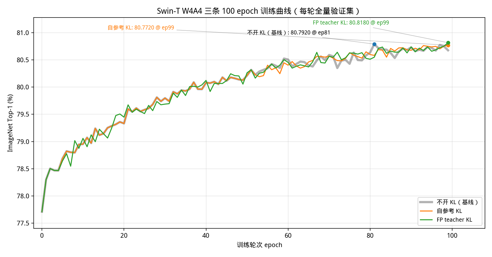
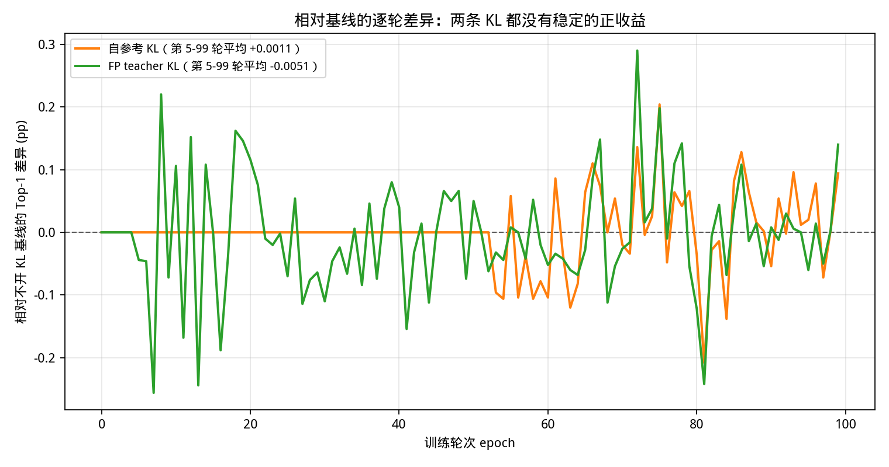

# FP Teacher KL 实验结果

日期: 2026-09-20

本文档整理 “用 FP Swin-T teacher 作为 refmodel，对高震荡/harmful attention head 做 attention relation KL” 这条
实验线的完整结果，包含三条 100epoch 轨迹、权重与 head 时间表、以及这条实验当前的结论边界。

对应代码与日志都在本仓库内，证据路径见文末。

## 0. 结论摘要

1. 这条实验**已经做完**，有效结果来自 `ofq_100ep_fromscratch_teacher_sparse_attnkl_clipgrad_20260804`：
   完整 100epoch，best Top-1 **80.8180** @ epoch 99，final 同为 80.8180。
2. 相对同设置的 no-KL 对照（80.7920 @ ep81），best 只高 **+0.0260**；逐 epoch 平均差 **-0.0051**，
   last10 **+0.0080**，last20 **-0.0113**，没有任何一致符号。因此**当前证据不足以证明 FP teacher KL 带来稳定收益**。
3. 相对 100epoch 老 KL（prev-step ref KL，80.7720 @ ep99），best 高 **+0.0460**，但 last10/last20 反而分别低
   -0.0150 / -0.0162。两者差距同样落在噪声量级。
4. **这条线不能当作 “refmodel 消融” 来读**：从老 KL 换到 FP teacher 时，同时变了 refmodel、KL 权重尺度（小 10 倍）、
   触发策略（val 触发脉冲 → 固定区间常开）、head 集合、以及 KL 覆盖的 epoch 数（10 → 85）。见第 4 节。
5. 全仓库最强单点仍然是 200epoch fixed-cycle prev-step KL 的 **80.8680** @ ep194（该实验同样缺少 200ep no-KL 对照）。

## 1. 实验类别

所有行都是 Swin-T OFQ/QAT ImageNet-1k，公共设置一致：

```text
method=ofq
model=swin_t
wbits=4, abits=4
wq_mode=statsq, aq_mode=lsq
qk_reparam=true
dataset=/tmp/imagenet1k_full_parquet
epochs=100, scheduler_epochs=100, lr=2e-4, min_lr=5e-6, weight_decay=0.0
batch_size=64/GPU x 8 GPU = 512 global, seed=42
amp=bf16, static_graph=true
ref_attn_kl_clip=20.0
full validation samples=50000（每个 epoch 都做）
```

硬件：mlx devbox，8 x NVIDIA H100 80GB HBM3（见 `.nohup.log` 里的 `nvidia-smi` 输出）。
单 epoch 约 590-600 s（约 1.33 H100 卡时），100epoch 整跑 `wall_seconds=60043`（约 133 H100 卡时）。

三组 KL 都是 `train_scheme=ema_ref_attn_kl`，且 **KL 项是「替换」而不是「叠加」**：
老 KL 与 200ep 路径的 `teacher_attn_kl_weight=0`，FP teacher 路径的 `ref_attn_kl_weight=0`。

## 2. 三条 100epoch 轨迹





三条曲线都来自 full validation（每个点 50000 样本）：

| 路径 | 日志 | full-val 点数 |
|---|---|---:|
| no-KL control | `experiment_logs/fullval_ge10/playground__train_ofq_100ep_fromscratch_original_ofq_public_control_20260714.log` | 100 |
| 老 KL: late sparse prev-step ref KL | `experiment_logs/fullval_ge10/playground__train_ofq_100ep_fromscratch_late_sparse_prevstep_refkl_20260713.log` | 100 |
| FP teacher KLD1 (clipgrad) | `experiment_logs/fullval_ge10/playground__train_ofq_100ep_fromscratch_teacher_sparse_attnkl_clipgrad_20260804.log` | 100 |

### 关键指标

| 指标 | no-KL control | 老 KL 100ep | FP teacher KLD1 |
|---|---:|---:|---:|
| Best Top-1 | 80.7920 | 80.7720 | **80.8180** |
| Best epoch | 81 | 99 | 99 |
| Final Top-1 | 80.6780 | 80.7720 | 80.8180 |
| Last10 avg | 80.7086 | **80.7316** | 80.7166 |
| Last20 avg | **80.6916** | 80.6965 | 80.6803 |
| >= 81.0 的 epoch 数 | 0 | 0 | 0 |

### 相对 no-KL 的差

| 口径 | FP teacher KLD1 | 老 KL 100ep |
|---|---:|---:|
| best | +0.0260 | -0.0200 |
| final | +0.1400 | +0.0940 |
| last10 | +0.0080 | +0.0230 |
| last20 | -0.0113 | +0.0049 |
| 逐 epoch 平均（ep5-99） | -0.0051 | +0.0011 |

分段平均差（FP teacher - no-KL）：

| 区间 | KL 状态 | 平均差 |
|---|---|---:|
| ep0-4 | 关闭 | +0.0000 |
| ep5-29 | 开，w=1e-6，3 个 head | -0.0110 |
| ep30-69 | 开，w=2e-6，5 个 head | -0.0168 |
| ep70-89 | 开，w=1e-6，3 个 head | +0.0191 |
| ep90-99 | 关闭 | +0.0080 |

单个 epoch 的最大赢/输是 ep72 +0.2900 / ep7 -0.2560，符号来回翻转，是典型噪声形态。

## 3. FP teacher KL 到底训了多少 epoch

这一点容易混，单独说明。**FP teacher KLD1 不是固定频率的脉冲，而是固定 epoch 区间“常开”**：

```text
epoch 0-4:   weight=0
epoch 5-29:  weight=1e-6, heads=custom_subset:8:4,11:18,6:1
epoch 30-69: weight=2e-6, heads=custom_subset:8:4,11:18,6:1,5:7,4:11
epoch 70-89: weight=1e-6, heads=custom_subset:8:4,11:18,6:1
epoch 90-99: weight=0
```

（epoch 编号为训练日志里的 0-based 编号。）

所以：整个 run 是 100 epoch，其中 **teacher KL 项在 85 个 epoch 里逐步常开**（日志中 4250/5000 个
`Train:` 记录块的 `TeacherAttnKL` 非零，正好是 85 x 50）。KL 只在最初 5 个和最后 10 个 epoch 关闭。

真正是脉冲的是另外两条：

| 路径 | 触发方式 | KL 生效的 epoch（0-based） | epoch 等效数 |
|---|---|---|---|
| 老 KL 100ep（20260713） | val 触发动态脉冲，ep51 后启用 | 53,54,55,64,65,73,78,79,85,98 | 10 |
| FP teacher KLD1（20260804） | 固定区间常开 | 5-89 连续 | 85 |
| 200ep fixed-cycle（20260731） | 固定周期脉冲（每 8 epoch 开 2 个） | 40,41,48,49,...,168,169,170,180,190 | 37 |

顺带纠一个容易踩的坑：“按 schedule 挂着 85 个 epoch” 不等于“有效地训了 85 个 epoch”。
`..._teacher_sparse_attnkl_fixed_20260803` 同样挂着 85 个 epoch，但梯度恒为 0（见第 6 节），等于 0 个 epoch 生效。

## 4. 变量对比：这不是受控的 refmodel 消融

| | 老 KL 100ep | FP teacher KLD1 | 200ep fixed-cycle |
|---|---|---|---|
| refmodel | 自己的 prev-step 状态 | FP Swin-T teacher（冻结） | 自己的 prev-step 状态 |
| 权重 | 1e-5（配了 2e-5 强档，实际一次都没触发） | 1e-6 / 2e-6 / 1e-6 | 1e-5 / 1.5e-5 / 5e-6 |
| 触发 | val 触发脉冲（ep51 后才启用，cooldown 6，每窗口 <= 3 次） | 固定区间常开 | 固定周期脉冲 |
| KL 步数 | 10 epoch 等效 | 85 epoch 等效 | 37 epoch 等效 |
| heads | 8:4, 5:7, 4:11 + 11:18, 6:1 | 8:4, 11:18, 6:1（30-69 加 5:7, 4:11） | 5:7, 4:11, 8:4 |
| 总 epoch | 100 | 100 | 200 |
| Best Top-1 | 80.7720 | 80.8180 | 80.8680 |

保持一致的只有：OFQ recipe、数据、seed 42、`ref_attn_kl_clip=20.0`、以及 head 家族的来源（都取自
2026-07-10 那次 attention relation 震荡分析里的 harmful/oscillation head 一族）。

从老 KL 换到 FP teacher，同时变了 **5 个变量**：refmodel、权重尺度（小 10 倍）、触发策略、head 集合、KL 覆盖 epoch 数。
因此 80.8180 与 80.7720 之间的 +0.0460 无法归因到 refmodel 本身，任何一条差异都解释得了。

补充两个量级上的事实：

- KL 覆盖的步数：teacher 是 85 个 epoch 常开，老 KL 只有 10 个 epoch 的脉冲，**相差 8.5 倍**。
- 权重尺度：teacher 是 1e-6/2e-6，老 KL 实际生效的是 1e-5，**teacher 的有效权重小一个数量级**。

## 5. FP teacher 这条的 head 覆盖

7 月那次震荡分析的排名（`docs/attn_relation_oscillation_analysis_20260710/analysis_report.md`）：

- 推荐用于 KL 的 harmful heads：`5:7, 4:11, 8:4, 1:2, 3:1`
- 震荡分数最高的 heads：`4:7, 4:8, 8:4, 8:9, 8:2, 6:1`

FP teacher KLD1 用的是 `8:4, 11:18, 6:1`，ep30-69 扩到 `8:4, 11:18, 6:1, 5:7, 4:11`：

- 覆盖到了 harmful 排名第 1、2、3（`5:7`、`4:11`、`8:4`），但前两名只在 ep30-69 参与；
- 震荡分数最高的 `4:7`、`4:8` 从未被约束；
- 一直常开的是 harmful 排名第 3、9、10（`8:4`、`11:18`、`6:1`）。

也就是说，这条实验**不是**“对最高震荡 head 做 FP teacher KL”，而是“对 harmful head 一族里的一部分做 FP teacher KL”。

## 6. 这条线上的四个坑

同一条实验实际跑了 4 次，前两次的结果都不能当结论用。

| run | 问题 | 结果表现 |
|---|---|---|
| `..._teacher_sparse_attnkl_20260803` | teacher attention collection 未开启（只在初始 `teacher_attn_kl_weight > 0` 时才收集，初始值为 0） | 日志里 `TeacherAttnKL` 恒为 0；只跑到 epoch 36 终止，best 79.9640（等于 no-KL 同 epoch） |
| `..._teacher_sparse_attnkl_fixed_20260803` | collection 已修好（`TeacherAttnKL=2.000e+01` 非零），但 clip 实现是 `torch.clamp(loss, max=20)`，值顶在上限时梯度为 0 | 100epoch 的 full-val Top-1 与 no-KL **逐点完全一致**，是一个“假 null” |
| `..._teacher_sparse_attnkl_clipgrad_20260804` | 无：clip 改成保持梯度（commit `b711247` “fix clipped ref loss gradients”） | 轨迹在 ep5 开始与 no-KL 分叉，**唯一有效的 teacher KL 结果** |
| `..._teacher_sparse_attnkl_latepolish_20260805` | teacher KL 推迟到 ep60 才打开，且 run 只跑到 epoch 65 | 只覆盖约 6 个 epoch 的 KL，未跑完；ep60-65 相对 no-KL 平均 -0.0177 |

第三个坑是强度：有效那版里 `TeacherAttnKL` 在 ep5-89 **每一轮都正好是 2.000e+01**，也就是始终顶在
`ref_attn_kl_clip=20.0` 的上限。这说明量化 student 与 FP teacher 的 attention relation 差距远大于 20，
这条 loss 从未被优化下去，实际是“被截断的固定幅度推力”，而不是可收敛的 KL。
乘上 1e-6/2e-6 的权重后，等效贡献只有 2e-5 ~ 4e-5。

所以这次实验真正测到的命题是：

> “极弱强度、固定区间常开的 FP teacher attention 锚定，不改变 100epoch from-pretrained 的 full-val 轨迹。”

它**没有**回答：

> “把 refmodel 从 self prev-step 换成 FP teacher，是否能解决 late-stage attention 抖动导致的精度回落。”

## 7. 要真正回答 refmodel 问题，需要的最小受控实验

**A. refmodel 消融（直接回答“是不是 refmodel 的问题”）**

固定除 refmodel 之外的一切：同一 head 集合、同一权重、同一触发策略、同一 epoch 数、同一 clip。

```text
统一: heads=5:7,4:11,8:4(+11:18,6:1)、weight=1e-5、clip=20.0、epochs=100、同一张固定 epoch 表
只变: A1 refmodel = prev-step 状态（自己）
      A2 refmodel = FP Swin-T teacher
```

现在老 KL 100ep 与 teacher KLD1 在权重（10 倍）、触发方式、head 集合、KL 步数（8.5 倍）上都不一致，
所以必须重跑，不能复用这两条结果做结论。

**B. 强度 gate（先确认这条 loss 真的能生效）**

固定 refmodel = FP teacher，先跑 5-10 epoch 的短门槛，把等效 KL 贡献从 1e-5 量级提到 1e-3 ~ 1e-2 量级
（提高权重，或放宽 `ref_attn_kl_clip`），并同时检查 `TeacherAttnKL` 是否还一直顶在上限。
只有确认轨迹出现可分辨分叉，再决定是否跑满 100/200epoch。

**C. 补 200ep no-KL 对照**

`ofq_200ep_fromscratch_fixedcycle_group_sparse_prevstep_refkl_20260731` 的 80.8680 目前没有同设置的
200ep no-KL 对照，无法判断它来自 fixed-cycle KL 还是来自把 public recipe 拉长到 200 epoch。

## 8. 复现与证据

启动脚本：

```text
tmp_scripts/run_ofq_100ep_fromscratch_teacher_sparse_attnkl_clipgrad_20260804.sh
tmp_scripts/run_ofq_100ep_fromscratch_teacher_sparse_attnkl_fixed_20260803.sh
tmp_scripts/run_ofq_100ep_fromscratch_teacher_sparse_attnkl_latepolish_20260805.sh
tmp_scripts/run_ofq_100ep_fromscratch_late_sparse_prevstep_refkl_20260713.sh
tmp_scripts/run_ofq_100ep_fromscratch_original_ofq_public_control_20260714.sh
tmp_scripts/run_ofq_200ep_fromscratch_fixedcycle_group_sparse_prevstep_refkl_20260731.sh
```

权重表 / head 表分别写在脚本里的 `build_teacher_attn_schedules()` 与 `build_fixed_cycle_overrides()`。

画图脚本（本页两张图由它生成）：

```bash
python3 tmp_scripts/plot_fp_teacher_kl_three_paths_20260920.py
```

日志（full validation 逐 epoch）：

```text
experiment_logs/fullval_ge10/playground__train_ofq_100ep_fromscratch_original_ofq_public_control_20260714.log
experiment_logs/fullval_ge10/playground__train_ofq_100ep_fromscratch_late_sparse_prevstep_refkl_20260713.log
experiment_logs/fullval_ge10/playground__train_ofq_100ep_fromscratch_teacher_sparse_attnkl_clipgrad_20260804.log
experiment_logs/fullval_ge10/playground__train_ofq_100ep_fromscratch_teacher_sparse_attnkl_fixed_20260803.log
experiment_logs/fullval_ge10/playground__train_ofq_100ep_fromscratch_teacher_sparse_attnkl_latepolish_20260805.log
experiment_logs/fullval_ge10/playground__train_ofq_200ep_fromscratch_fixedcycle_group_sparse_prevstep_refkl_20260731.log
```

关键代码位置：

```text
qat_launch.py: maybe_clip_ref_loss()          # 梯度保持的 clip（commit b711247）
qat_launch.py: attention_kl_consistency_loss() # teacher/ref attention KL 主体
qat_launch.py: 第 6695 行附近                   # teacher_attn_kl_loss 与权重相乘
```

## 9. 完整性说明

- 所有对比行的 full validation 都是 `Samples: 50000`，来自 `Test: [distributed-summary]` 行。
- 三条 100epoch 轨迹的 full-val 点数都是 100，覆盖 epoch 0-99，可以直接逐点对齐。
- 日志末尾的 NCCL/TCPStore warning 出现在最终 validation 与 `wall_seconds` 之后，属于退出阶段告警，不影响结果有效性。
- 本文档只做离线日志与曲线分析，没有启动训练，也没有使用 checkpoint averaging / soup / ensemble。
